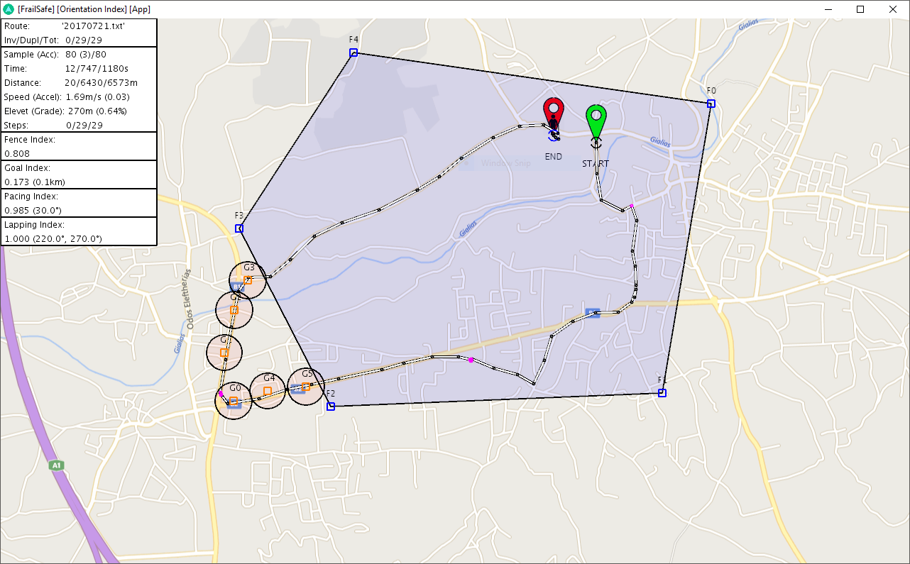

# Loss Of Orientation (LoO) Application

The LoO service identifies loss of orientation of (older) people based on (a) outdoor tracking information and (b) geo-fencing data, i.e. predefined boundaries of where the participant is supposed to be, in order to inform the caregiver that a participant is probably wandering. More specifically, the core functionalities of this application are (a) filter localization input to extract walking paths, rejecting segments where the user is standing still or being transported in a vehicle (e.g. driving), (b) trigger alarms when the user walks outsize his geofencing boundaries and finally (c) extract lapping/pacing indices; two values that indicate if the user’s walking path contains looping circuit or back and forth patterns.

This research work has received funding from the European Union’s Horizon 2020 research and innovation programme “[FrailSafe](http://www.frailsafe-project.eu/)” under grant agreement No 690140.
